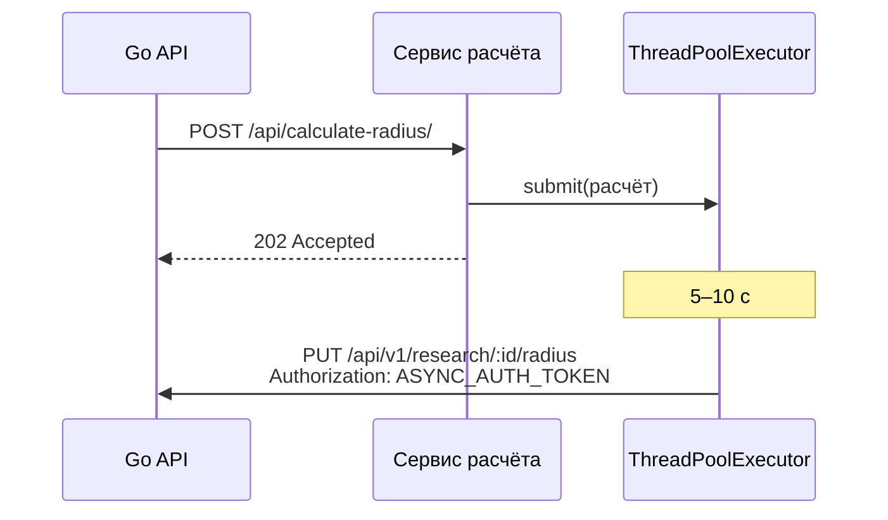

# Exoplanet Radius — сервис асинхронного расчёта

[](https://github.com/dima040805/RIP-25-26---async/actions/workflows/ci.yml)


Вспомогательный сервис к [Exoplanet Radius API](https://github.com/dima040805/RIP-25-26).
Когда модератор одобряет исследование, основной Go-сервис отправляет сюда каждую
планету. Расчёт выполняется в пуле потоков с задержкой 5–10 секунд, как долгая
задача, а результат возвращается в основной сервис отдельным запросом.

Проект сделан в курсе «Разработка интернет-приложений» (МГТУ им. Н. Э. Баумана, ИУ5, 2025).

## Как это работает



Радиус: `R_p = R_star · √(ΔF / 100)`. Если падение блеска `ΔF ≤ 0`, расчёт считается
неуспешным и результат не отправляется.

## API

| Метод | Путь | Ответ | Назначение |
|---|---|---|---|
| POST | `/api/calculate-radius/` | 202 / 400 | расчёт одной планеты: `research_id`, `planet_id`, `star_radius`, `planet_shine` |
| POST | `/api/calculate-research-radii/` | 202 / 400 | заготовка пакетного расчёта по `research_id` |
| GET | `/api/health/` | 200 | проверка живости |

## Переменные окружения

| Переменная | По умолчанию | Описание |
|---|---|---|
| `MAIN_SERVICE_URL` | `http://localhost:8080/api/v1` | адрес основного API |
| `ASYNC_AUTH_TOKEN` | `secret123` | общий секрет с основным API |
| `DJANGO_SECRET_KEY` | `dev-insecure-key` | секретный ключ Django |
| `DJANGO_DEBUG` | `1` | режим отладки |
| `DJANGO_ALLOWED_HOSTS` | `*` | список хостов через запятую |

## Запуск

```bash
python -m venv .venv && source .venv/bin/activate
pip install -r requirements.txt
python manage.py runserver 0.0.0.0:8000
```

Или в Docker:

```bash
docker build -t exoplanet-async .
docker run --rm -p 8000:8000 -e MAIN_SERVICE_URL=http://host.docker.internal:8080/api/v1 exoplanet-async
```

## Тесты

```bash
python manage.py test
```

## Связанные репозитории

- API: [RIP-25-26](https://github.com/dima040805/RIP-25-26)
- Фронтенд: [RIP-25-26-Frontend](https://github.com/dima040805/RIP-25-26-Frontend)
